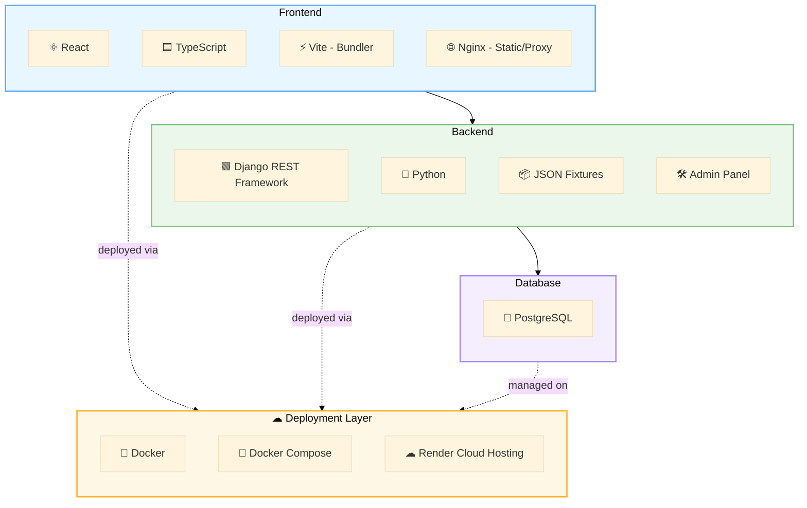

# db
```bash
python manage.py loaddata api/fixtures/backup_db.json
```

# docker
```bash
docker compose up -d
docker compose down -v

docker compose exec web poetry run python manage.py makemigrations api
docker compose exec web poetry run python manage.py migrate

```

# front
```bash
npm run build
npm run dev
```

# app schema for https://www.mermaidchart.com/

```mermaid
%%{ init: { "theme": "base", "themeVariables": { "handDrawn": false }}}%%
flowchart TB
    subgraph FRONTEND [Frontend]
        direction TB
        A1[⚛ React] 
        A2[🟦 TypeScript] 
        A3[⚡ Vite - Bundler]
        A4[🌐 Nginx - Static/Proxy]
    end

    subgraph BACKEND [Backend]
        direction TB
        B1[🟩 Django REST Framework] 
        B2[🐍 Python]
        B3[📦 JSON Fixtures]
        B4[🛠 Admin Panel]
    end

    subgraph DATABASE [Database]
        direction TB
        C1[🐘 PostgreSQL] 
    end

    FRONTEND --> BACKEND --> DATABASE

    subgraph DEPLOY [☁ Deployment Layer]
        direction TB
        D1[🐳 Docker] 
        D2[🧩 Docker Compose] 
        D3[☁ Render Cloud Hosting]
    end

    FRONTEND -. deployed via .-> DEPLOY
    BACKEND -. deployed via .-> DEPLOY
    DATABASE -. managed on .-> DEPLOY

    style FRONTEND fill:#E8F7FF,stroke:#5BA8FF,stroke-width:2px
    style BACKEND fill:#EAF7EA,stroke:#7BC47F,stroke-width:2px
    style DATABASE fill:#F4EEFF,stroke:#A78BFA,stroke-width:2px
    style DEPLOY fill:#FFF7E6,stroke:#FFB02E,stroke-width:2px
```

# dev merge in prod!
```bash
git checkout prod  
git pull origin dev  
git merge dev  
git push origin prod
```